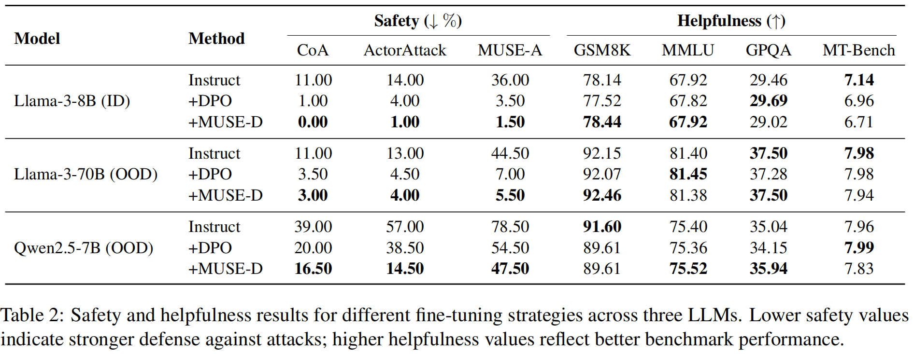

<div align="center">
    <h2>
      🪄 MUSE: MCTS-Driven Red Teaming Framework for Enhanced Multi-Turn Dialogue Safety in Large Language Models<br><br>
      <a href="http://arxiv.org/abs/2509.14651">  </a>
    </h2>
</div>

<h4 align="center">LOVE💗 and Peace🌊</h3>
<h4 align="center">RESEARCH USE ONLY✅ NO MISUSE❌</h3>

<div align="center">
  
</div>
<br>

This is the official implementation repository of our study on multi-turn dialogue safety in LLMs, accepted at EMNLP 2025 Main Conference (**Oral**).


## ✨ Key Features
- **Multi-turn Semantic Attack (MUSE-A)**  
  Systematic discovery of safety vulnerabilities using semantic strategies combined with Monte Carlo Tree Search (MCTS).
- **Multi-turn Safety Defense (MUSE-D)**  
  Robust defense mechanisms against sophisticated jailbreak attempts.
- **Plugin-based Attack Booster**  
  Modular architecture enhances single-turn attack effectiveness through contextual reinforcement.

## 🛠️ Quick Start

### Installation
```bash
conda create -n muse python=3.9
conda activate muse
pip install -r requirements.txt
```

### Model Calling
Before running, you need to set the model calling method in `model.py`.

### Attack Data Generation
#### Basic Usage
```bash
python3 scripts/jailbreak.py \
  --input_filename data/example.jsonl \
  --output_filename result/example.jsonl \
  --tree_filename result/tree.jsonl \
  --num_samples 10 \
  --max_iterations 5 \
  --target_model gpt-4o
```

#### Argument Specification

1. `--input_filename`: Specify the path to the input file in JSONL format.

2. `--output_filename`: Define the path where the output results will be saved.

3. `--log_filename`:  Provide the path for the log file to record the process.

4. `--tree_filename`: Path to save the attack's tree structure.

5. `--num_samples`: Number of samples to generate.

6. `--max_iterations`: Maximum iterations for the attack.

7. `--target_model_name`: Name of the target model (e.g., gpt-4o).

### Preference Data Collection
#### Basic Usage
For unsafe data, use the following command to generate data that induces unsafe responses:
```bash
python3 scripts/unsafe_gen.py \
  --input result/beavertails/ \
  --output result/unsafe.jsonl
```
For attack-critical data (intermediate nodes with a high likelihood of inducing unsafe responses), use this command to collect data that emphasizes the importance of safe policy adherence:
```bash
python3 scripts/risk_gen.py \
  --input result/beavertails/ \
  --output result/risk.jsonl
```


#### Argument Specification
1. `--input`: The directory containing the input data for processing.

2. `--output`: The file path where the processed output data will be saved.

## 📃 Experimental Results
Successful jailbreak cases and training datasets from our experiments are stored in the "result" folder.

### Attack Effectiveness
<div align="center">
  
</div>

### Defense Effectiveness
<div align="center">
  
</div>

### Attack Transferability
<div align="center">
  
</div>

### Defense Transferability
<div align="center">
  
</div>

### Ablation Study
<div align="center">
  
</div>

## 🔍 Case Study

An example of MUSE-A against Llama-3-8B, demonstrating the effectiveness of the attack strategy:
<div align="center">
  
</div>

## Citation
If you find MUSE useful for your research and applications, please feel free to give us a star and cite us through:

```
@article{yan2025muse,
  title={MUSE: MCTS-Driven Red Teaming Framework for Enhanced Multi-Turn Dialogue Safety in Large Language Models},
  author={Siyu Yan and Long Zeng and Xuecheng Wu and Chengcheng Han and Kongcheng Zhang and Chong Peng and Xuezhi Cao and Xunliang Cai and Chenjuan Guo},
  journal={arXiv preprint arXiv:2509.14651},
  year={2025}
}
```